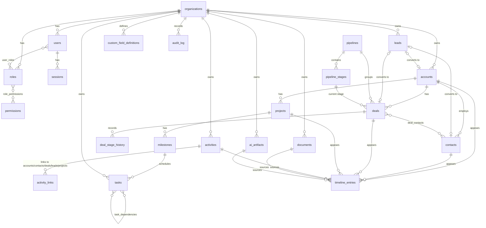

# Prompt 2 — Database Design

PostgreSQL 18. Schema source of truth: `apps/api/src/db/schema/` (Drizzle, TypeScript).
Generated SQL: `apps/api/drizzle/0000_init.sql` (26 tables) + `0001_updated-at-trigger.sql`.
Apply with `npm run db:setup -w @crm/api` (creates `crm` and `crm_test`, migrates both).

Approved naming decision: the pipeline entity is **Deals** (not Opportunities).

## ER diagram

## Table catalog

| Domain | Tables |
|---|---|
| Identity | `organizations`, `users`, `sessions`, `roles`, `permissions` (global catalog), `role_permissions`, `user_roles` |
| CRM core | `accounts`, `contacts` |
| Pipeline | `leads`, `pipelines`, `pipeline_stages`, `deals`, `deal_contacts`, `deal_stage_history` |
| Work | `activities`, `activity_links`, `tasks`, `task_dependencies`, `projects`, `milestones` |
| Content | `documents`, `timeline_entries`, `custom_field_definitions` |
| AI | `ai_artifacts` |
| Audit | `audit_log` |

## Key design decisions

**Primary keys.** `uuid` with `DEFAULT uuidv7()` (built into PG 18): globally unique like
uuid4, but time-ordered, so B-tree inserts append instead of fragmenting. `audit_log` uses a
bigint identity — highest-volume table, never exposed externally.

**Tenancy.** Every tenant-owned table carries `organization_id NOT NULL` with
`ON DELETE CASCADE` — deleting an organization purges the tenant completely. Row-level
security policies on these columns land in Prompt 4 (auth), on top of this schema.

**Polymorphic links without polymorphism.** `activity_links`, `timeline_entries`,
`documents`, `tasks`, and `ai_artifacts` relate to accounts/contacts/deals/leads/projects via
one nullable, real FK column per target — not `(entity_type, entity_id)` pairs — so the
database keeps referential integrity. `activity_links` enforces exactly one target per row
(`num_nonnulls(...) = 1`) and blocks duplicate links with a `NULLS NOT DISTINCT` unique
constraint; `timeline_entries` requires at least one target.

**Custom fields: JSONB over EAV.** Definitions (type, label, validation rules, options) live
in `custom_field_definitions`; values live in a `custom` jsonb column on each supporting
entity (`accounts`, `contacts`, `deals`, `leads`, `projects`), GIN-indexed. Rationale: reads
stay single-row (no value-table joins), filtering uses jsonb operators against the GIN index,
and validation belongs to the service layer against the definitions anyway. Trade-off
accepted: no per-value FK integrity — Prompt 18's validation layer owns that.

## Foreign keys & cascade rules

| Rule | Where | Why |
|---|---|---|
| `CASCADE` from `organizations` | every tenant table | tenant purge is one statement |
| `CASCADE` child → parent | stages→pipeline, milestones→project, stage_history→deal, links→activity, deal_contacts, task_dependencies, role/user joins, sessions→user | children are meaningless without the parent |
| `CASCADE` record-scoped content | deals/projects→account; activities-links/tasks/documents/timeline/ai_artifacts → their subject record | hard delete = purge; everything about the record goes with it |
| `SET NULL` ownership/actor | `owner_id`, `assignee_id`, `actor_user_id` → users | users are deactivated, not deleted; data outlives people |
| `SET NULL` conversions & sources | lead `converted_*`; timeline `document_id`/`ai_artifact_id`; artifacts `source_activity_id`; tasks `milestone_id` | reference is informational, target removal shouldn't destroy the row |
| `RESTRICT` | deals → `pipeline_id`, `stage_id` | can't delete a pipeline/stage still in use |
| No FK (plain uuid) | `created_by`, `updated_by`, `changed_by`, `reviewed_by`, audit `user_id` | audit provenance must survive any cleanup; avoids FK sprawl on every table |

## Indexes

- Composite `(organization_id, …)` on every common access path: account/contact name lookups,
  contact + lead email matching (`lower(email)` expression indexes, for Prompt 11's matching),
  deal stage/status/close-date/owner, task assignee+status and due dates, artifact kind+status.
- Timeline: `(organization_id, occurred_at DESC)` plus `(entity_id, occurred_at DESC)` per
  target column — the per-record timeline is the hottest query in the app.
- GIN on every `custom` jsonb column for Prompt 18 filtering.
- Unique: global `lower(email)` for users, org+name for roles/pipelines, pipeline+name for
  stages, org+entity+key for custom field definitions.
- Full-text/tsvector indexes deliberately deferred to Prompt 17 (search) — added when the
  query shape is known.

## Auditing strategy

Two complementary layers:

1. **`audit_log` table** — append-only; the repository layer writes one row per mutation
   (action, entity type/id, user, jsonb diff of changed fields). Queryable per record and per
   org. App-written rather than trigger-written so entries carry the acting user and only
   meaningful diffs; the Prompt 4 auth layer makes the acting user available everywhere.
2. **In-row provenance** — `created_by`/`updated_by`/`created_at`/`updated_at` on business
   tables; `updated_at` enforced by a database trigger (migration 0001) so no code path can
   forget it.

Stage changes additionally get first-class history (`deal_stage_history`) because Prompt 6
needs to report on it, not just audit it.

## Soft delete strategy

- `deleted_at timestamptz` on user-facing business records: accounts, contacts, leads, deals,
  activities, tasks, projects, documents. Default queries filter `deleted_at IS NULL`
  (enforced in the repository layer, Prompt 5); restore = set null.
- **Not** soft-deleted: append-only tables (`timeline_entries`, `audit_log`,
  `deal_stage_history`), configuration (pipelines, stages, roles, custom field definitions —
  they use `is_active`-style flags or RESTRICT), join tables, and `users`
  (`is_active = false` instead — identity must remain unique and referable).
- Hard delete exists only as explicit purge (record- or tenant-level); FK cascade rules above
  are designed for exactly that moment.

## Deferred by design

- RLS policies → Prompt 4 (they are the auth model's enforcement arm).
- pgvector extension + embedding tables → Prompt 8 (AI foundation).
- tsvector search columns → Prompt 17.
- Record types / layout tables → Prompt 18 (definitions table already reserves `rules` jsonb).
